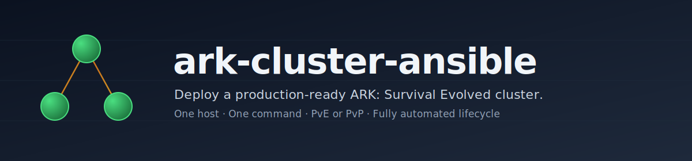

<p align="center">
  
</p>

<p align="center">
  <a href="https://github.com/donovanm21/ark-cluster-ansible/actions/workflows/test.yml"></a>
  <a href="https://github.com/donovanm21/ark-cluster-ansible/releases/latest"></a>
  <a href="LICENSE"></a>
  <a href="https://docs.ansible.com/"></a>
  <a href="#prerequisites"></a>
  <a href="https://github.com/arkmanager/ark-server-tools"></a>
</p>

---

## Why this exists

Running a multi-map ARK cluster by hand means wrestling with steamcmd, hand-crafting each `instance.cfg`, keeping port maps in a spreadsheet, and remembering to restart for game updates before your players do. This playbook turns all of that into one YAML file and one command.

It's the real configuration behind a running production cluster — hardened, documented, and scrubbed of secrets — not a sketch.

## What you get

- **Multi-map cluster** with cross-map tame/item transfer via a shared cluster ID
- **One flag** (`server_mode: PvE | PvP`) flips the relevant `.ini` switches for your play style
- **Fully automated lifecycle** — the cluster keeps itself alive after `ansible-playbook` exits:
  - Daily restart + backup + game update + mod update pipeline (with in-game countdown broadcasts)
  - Hourly game/mod update checks with auto-restart when new versions ship
  - 5-minute crash watchdog — a dead `ShooterGameServer` comes back on its own
  - Optional Discord webhook notifications on lifecycle events
  - logrotate for `ShooterGameServer` and arkmanager logs
- **CI/CD in the box** — GitHub Actions workflows lint, syntax-check, and secret-scan on every push; an optional deploy workflow SSHes to your host and runs the playbook after tests pass
- **Bring-your-own ini files** — drop hand-tuned `Game.ini` / `GameUserSettings.ini` into a local `config/` directory and the playbook overlays them on top of the rendered templates. Beacon.app users: this is for you

## Quickstart

The quickest path is the TUI bootstrap — it checks your hardware, walks you through picking maps, writes the config, and runs the playbook:

```bash
git clone https://github.com/<your-fork>/ark-cluster-ansible.git
cd ark-cluster-ansible
sudo ./bootstrap.sh
```

[`bootstrap.sh`](bootstrap.sh) is a whiptail-driven menu with Deploy / Redeploy / Dry-run / Status / Edit / Destroy. It auto-installs `whiptail` and `ansible-core` the first time, then stays out of your way.

Prefer the manual path?

```bash
cp group_vars/gameservers.yml.example group_vars/gameservers.yml
cp inventory_remote.example           inventory_remote
${EDITOR:-vim} group_vars/gameservers.yml
ansible-playbook -i inventory_remote main.yml
```

Both paths land in the same place. If something goes wrong, open an issue — we'd rather fix the playbook than leave you stuck.

Prefer a fully-populated starter?

| Starter | Style |
|---|---|
| [docs/examples/gameservers.pve.yml](docs/examples/gameservers.pve.yml) | 3-map PvE, friendly progression, dino wipes on |
| [docs/examples/gameservers.pvp.yml](docs/examples/gameservers.pvp.yml) | 3-map PvP, closer-to-official rates, offline raid protection |

## What a cluster looks like

```
          group_vars/gameservers.yml
       +------------------------------+
       |  server_mode: PvE            |
       |  maps:                       |
       |   - Ragnarok                 |
       |   - TheIsland                |
       |   - ScorchedEarth            |
       |  cluster_name: myCluster     |
       +--------------+---------------+
                      |  ansible-playbook
                      v
    +--------------------------------------------+
    |            your Linux host                 |
    |  +----------+  +----------+  +----------+  |
    |  | Ragnarok |  |TheIsland |  | Scorched |  |
    |  |  :7779   |  |  :7791   |  |  :7777   |  |
    |  +----+-----+  +-----+----+  +-----+----+  |
    |       |              |             |       |
    |       +------- cluster ------------+       |
    |           (cross-map transfers)            |
    |                                            |
    |   crons:  update-check | watchdog | backup |
    +--------------------------------------------+
```

## Prerequisites

- Linux host — Ubuntu 20.04+ or Debian 11+
- Ansible 2.10 or newer (on your workstation or the target host)
- Roughly **50 GB disk** and **6 GB RAM** per concurrently running map
- Open TCP/UDP for each map's game port (7777+), Steam query port (27015+), RCON port (32330+)

The playbook installs arkmanager, steamcmd, and every other dependency. You only supply the host.

## Configuration

A quick sketch of the config surface — full variable reference in the per-role READMEs below.

| What | Where |
|---|---|
| Who you are | `location`, `server_tag`, `server_mode` |
| Maps, ports, mods | the `maps:` list |
| Gameplay feel | taming / harvest / XP multipliers, decay periods |
| Lifecycle | `daily_update_hour`, `enable_watchdog`, `enable_dino_wipe` |
| Admins | the `admins:` list of 17-digit SteamIDs |
| Discord notifications | `discord_webhook_url` |
| Your own ini files | drop into `./config/` — overlays the rendered templates |

Per-role documentation:

- [roles/provision/README.md](roles/provision/README.md) — OS deps, ark user, sudoers, firewall
- [roles/arkmanager/README.md](roles/arkmanager/README.md) — arkmanager netinstall
- [roles/maps/README.md](roles/maps/README.md) — per-map configs, Game.ini, mods
- [roles/system/README.md](roles/system/README.md) — crontab, watchdog, logrotate, scripts

## Continuous integration

Every push runs:

1. **yamllint** — style and structural linting
2. **ansible-lint** — anti-pattern detection (advisory)
3. **ansible-playbook --syntax-check** + `--list-tasks` — structural sanity
4. **gitleaks** — secret scan over the full git history

The optional deploy workflow SSHes to your target host and runs `ansible-playbook --check --diff` for a visible dry-run, then applies. Flip between apply and dry-run per run via `workflow_dispatch`.

See [`.github/workflows/`](.github/workflows/).

## Contributing

PRs welcome — see [CONTRIBUTING.md](CONTRIBUTING.md). The bar is:

- CI is green
- `gameservers.yml` and `inventory_remote` stay out of the diff
- New variables have defaults and a line in the docs

## Security

- [SECURITY.md](SECURITY.md) documents the NOPASSWD sudo default, the UFW-removal default, and what to avoid committing
- Report vulnerabilities privately to the maintainer before any public disclosure

## Acknowledgements

Built on top of [arkmanager / ark-server-tools](https://github.com/arkmanager/ark-server-tools). Thanks to that project and everyone who's poked holes in this playbook over the years.

## License

[MIT](LICENSE). Fork it, run it, ship your own cluster.
